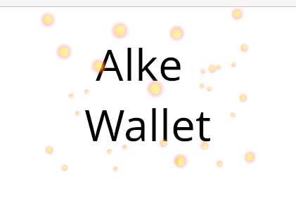
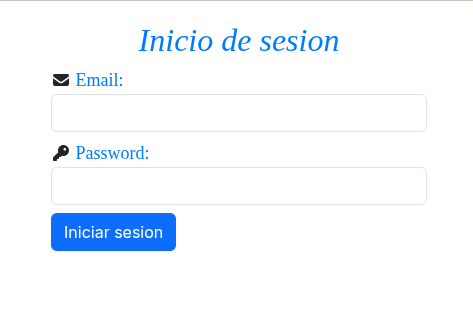
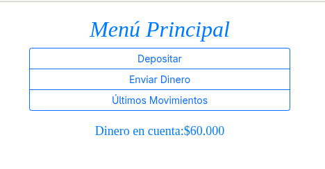
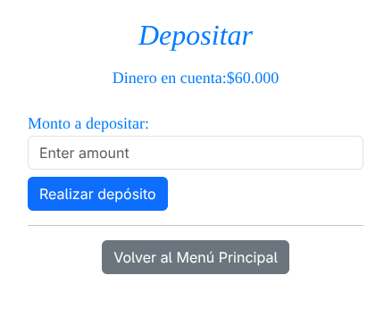
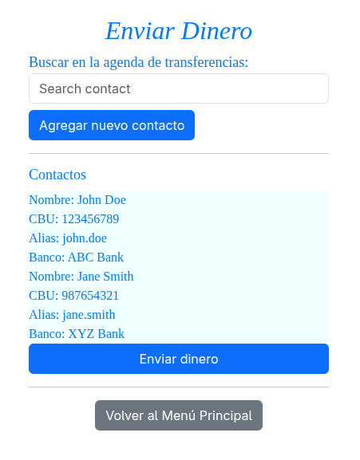
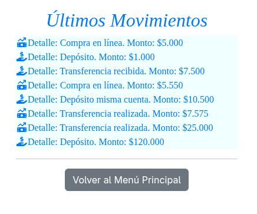

# __MODULE-2__
## Proyecto Modulo 2: Fundamentos de desarrollo Front-End.
### La aplicacion consiste en un e-wallet.
 

## __Instalacion__:
### 1. Crear un directorio en el cual se albergara la aplicacion.
### 2. Ingresar al directorio (por consola).
### 3. Ejecutar el comando (sin comillas) 'git clone https://github.com/Sence-Courses/module-2.git'
### 4. Ejecutar el comando (sin comillas) 'git checkout develop'
 

## __Ejecucion__:
### Una vez cumplidos los pasos del proceso de instalacion y estando en la carpeta de la aplicacion copiar el path del archivo index.html y pegarlo en una pestaña del navegador.
 

## __Modo de uso__:
### La aplicacion consiste en paginas web las cuales se navegan a traves de enlaces puestos en las mismas.
### A continuacion se muestra el flujo de la aplicacion.

### __Pagina de Inicio__

#### Pagina inicial, la cual redirije a la pagina de [Login](#pagina-de-login) despues de unos instantes.

### __Pagina de Login__

#### Pagina de login para el ingreso a la aplicacion.
#### Se ingresan los campos de usuario (Email) y clave (Password).
#### Los campos se evaluan inicialmente para validar el formato de los mismos. [imagen](Images/LoginValidacionCliente.png)
#### Al pasar la validacion se vuelve a validar si el usuario existe. [imagen](Images/LoginValidacionServidor.png)
#### Una vez validados los datos y presionar el boton de 'Iniciar sesion' se muestra un mensaje indicando la pagina de destino y pasado unos instantes se redirije a la pagina de Menu principal. [imagen](Images/LoginValidacionOK.png)

### __Pagina de Menu Principal__

#### Pagina desde la cual se puede ver inicialmente el monto actual y desde la cual se puede navegar hacia las distintas paginas de actividades de la aplicacion.
#### Mensaje de redireccion a la pagina de [Deposito](Images/MenuPrincipalRedDeposito.png).
#### Mensaje de redireccion a la pagina de [Envio de dinero](Images/MenuPrincipalRedEnvio.png).
#### Mensaje de redireccion a la pagina de [Ultimos movimientos](Images/MenuPrincipalRedTrxs.png).

### __Pagina de Depositar__

#### En esta pagina se hacen los depositos a la cuenta asociada al e-wallet.
#### Se ingresa el monto en el campo habilitado. [imagen](Images/DepositarIngresaMonto.png)
#### Despues de presionar el boton 'Realizar deposito' se muestra un mensaje con el detalle del deposito. [imagen](Images/DepositarMsgOK.png)

### __Pagina de Enviar Dinero__

#### Pagina para el ingreso de nuevos contactos y el envio de dinero a los mismos.
#### Para ingresar un nuevo contacto se persiona el boton 'Agregar nuevo contacto' el cual muestra una ventana desde la cual ingresar los datos del nuevo contacto. [imagen](Images/NuevoContacto.png)
#### Una vez ingresados los datos se presiona el boton 'Agregar'. [imagen](Images/NuevoContactoDatos.png)
#### Una vez validados los datos se muestra un mensaje de confirmacion. [imagen](Images/NuevoContactoMsgOK.png)
#### Una vez en la pagina principal se muestra el nuevo contacto en la lista. [imagen](Images/EnvioDineroContactoAgregado.png)
#### Para el envio de dinero se selecciona un contacto y se presiona el boton 'Enviar dinero'. [imagen](Images/EnvioDineroContactoSeleccionado.png)
#### Se muestra una ventana con los datos del contacto y con un campo habilitado para ingresar el monto a transferir. [imagen](Images/EnvioDineroMonto.png)
#### Al presionar el boton 'Enviar' se muestra un mensaje con el detalle de la transferencia. [imagen](Images/EnvioDineroMsgOK.png)

### __Pagina de Ultimos Movimientos__

#### En esta pagina se muetran las transacciones de entrada y salida de la aplicacion. 